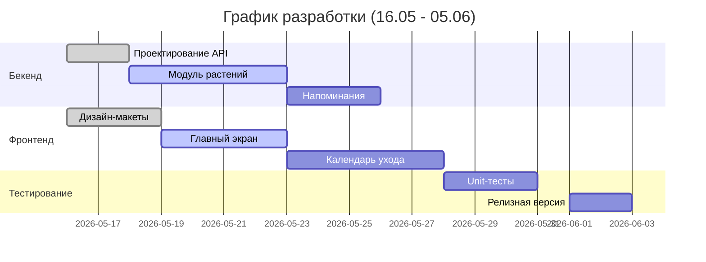

# **PLANT DOCTOR - мониторинга здоровья растений**

## **Актуальность**
**Проблема**: 68% комнатных растений гибнут из-за неправильного ухода.  
**Решение**: Веб-приложение с:  
- Персональным календарем ухода 
- Базой знаний по некоторым видам растений  

## **Участники и роли**

| Участник | Роли | Ответственность | Технологии |
|----------|------|------------------|------------|
| **Максим** | Fullstack-разработчик | • API (Flask)   • База данных   | Python, PostgreSQL |
| **Никита** | Frontend-разработчик/Дизайнер | • PWA-интерфейс   • Дизайн системы   • Тестирование | Figma, Jest |

## **Цели и задачи**
**Главная цель**: Снижение смертности растений на 40% через автоматизацию ухода  

## **Этапы разработки**

## **Ресурсы и инструменты**

**Технические**:  
- **Backend**: Flask + SQLAlchemy 
- **Frontend**: React PWA + Material-UI  

**Организационные**:  
- **Управление**: GitHub Issues
- **Коммуникация**: Discord + Telegram

## **Критерии успеха**
1. **Функциональные**:  
   - Работающее ядро системы (добавление/удаление растений, напоминания)  
   - 3 основных экрана в интерфейсе  

2. **Технические**:  
   - Покрытие тестами ключевых модулей  
   - Среднее время отклика API < 500ms  

3. **Организационные**:  
   - 100% выполнение задач по графику  

## **Инструкция по запуску**

### **1. Установка зависимостей**

* Убедитесь, что у вас установлен Python 3.8 или выше
* Создайте виртуальное окружение (рекомендуется):

`первая команда: python -m venv venv`

`вторая команда: venv\Scripts\activate`

* Установите зависимости:

`команда: pip install -r requirements.txt`

### **2. Настройка окружения**

* Создайте файл .env в корневой директории проекта:

`команда: touch .env`

* Добавьте в него следующие переменные:

`SECRET_KEY=your-secret-key-here`

`DATABASE_URL=sqlite:///database/plantdoctor.db`

### **3. Инициализация базы данных**

* Запустите инициализацию базы данных (уже создана, этот шаг необходимо пропустить):

`команда: python database/init_db.py`

### **4. Запуск сервера**

`команда: python backend/app.py`

Сервер запустится на http://localhost:5000

## **Инструкция по запуску тестов**

### **1. Установка зависимостей**

* Запустите виртуальное окружение:

`команда: venv\Scripts\activate`

* Установите зависимости:

`команда: pip install -r requirements-tests.txt`

### **2. Настройка окружения**

* Необходимо во всех файлах теста заменить пути. Пример:

`app -> backend.app`

Это связано с проблемой установки путей.

### **3. Запуск тестов**

* Запустите тесты

`python backend/app.py`
